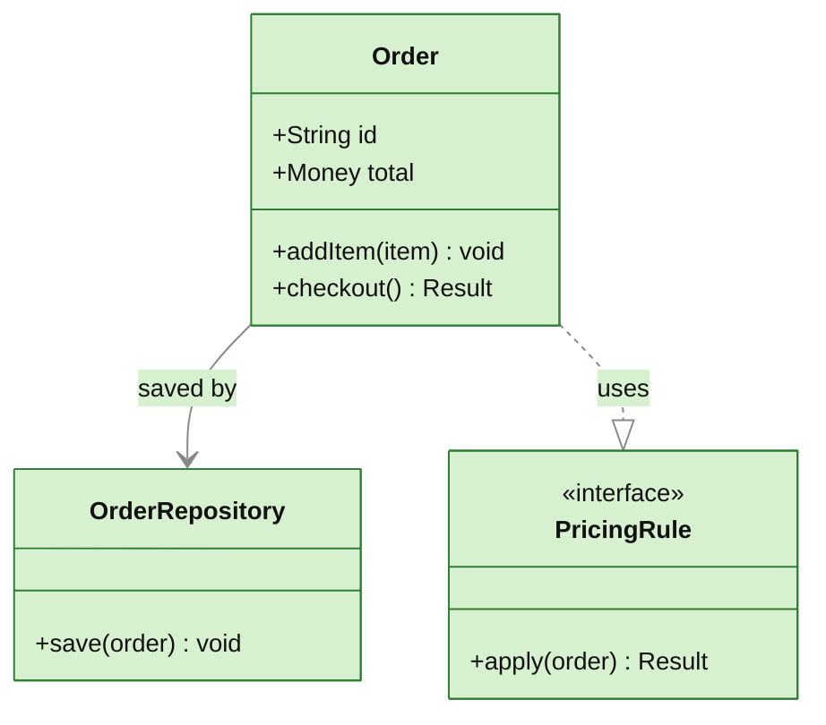

# class — data model / object structure / interfaces

**Use when** showing code structure: classes, their fields and methods, inheritance/composition, interface contracts. NOT for stored-data entities + cardinality (use ER).

## Canonical template

## Relationship arrows

| Syntax | Meaning |
|---|---|
| `A --> B` | association |
| `A ..> B` | dependency |
| `A --|> B` | inheritance (B is parent) |
| `A ..|> B` | realises interface B |
| `A --* B` | composition |
| `A --o B` | aggregation |

Visibility: `+` public, `-` private, `#` protected, `~` package. `<<interface>>` / `<<abstract>>` / `<<enumeration>>` stereotypes go on their own line inside the class body.

## Gotchas

- Method/field lines live **inside** `class X { … }` braces; relationships go **outside**.
- Generics: write `List~LineItem~` (tilde-delimited), not `List<LineItem>` (`<>` breaks parsing).
- Labels on relationships go after `:` and are freeform.
- **Stereotype `<<interface>>` contains `<` — some doc renderers don't HTML-escape code blocks and will eat it** (the stereotype vanishes or the diagram errors). The template is valid mermaid (`mermaid.parse` passes); if it breaks, it's the renderer mangling `<`. Verify in the target renderer; if it can't be fixed, drop the stereotype line.
