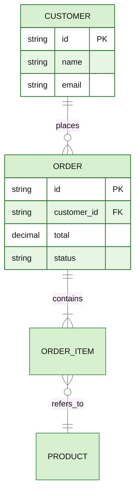

# ER — entities and relationships (data model)

**Use when** showing stored data: tables/entities, their attributes, and cardinality between them. NOT for code classes (use class) or process flow (use flowchart).

## Canonical template

## Cardinality (the crow's-foot codes)

| Left/right symbol | Means |
|---|---|
| `||` | exactly one |
| `o|` | zero or one |
| `}o` / `o{` | zero or many |
| `}|` / `|{` | one or many |

Read `CUSTOMER ||--o{ ORDER` as "one CUSTOMER places zero-or-many ORDERs". The relationship label after `:` is required.

## Gotchas

- Attribute blocks (`ENTITY { … }`) are optional; include them only when the columns matter — they make the box tall.
- Attribute line shape: `type name [PK|FK|UK] "optional comment"`.
- Entity names are conventionally UPPER_SNAKE; they can't contain spaces.
