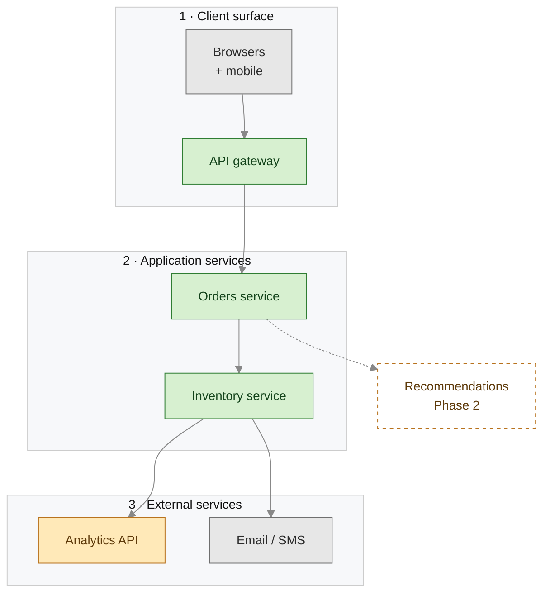
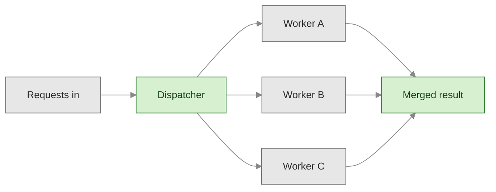

# flowchart — components, layers, architecture

**Use when** showing structure: components and how they relate, a layered/system architecture, a build-vs-buy map, a decision tree, a one-to-many fan-out. NOT for time-ordered message flows (use sequence).

## Canonical template — layered architecture

`flowchart TB` outside, `direction LR` inside each subgraph → each layer is a horizontal band, layers stack top-to-bottom. Independent layers chained with `~~~` so they don't spread sideways.

## Simple fan-out (one-to-many)

## Gotchas

- **Too wide?** Independent subgraphs spread sideways. Chain with `G1 ~~~ G2 ~~~ G3` to stack vertically; or switch `TB`↔`LR`.
- **Hairball?** Drop edges that only restate subgraph membership. Order subgraphs to match flow.
- **Edge labels:** `A -->|label text| B` — plain text, no quotes, avoid `/` `()` in the label.
- **Subgraph titles + edge labels read grey on a light-text host page** (a dark-themed doc site whose CSS sets `p{color:light}`) — they're htmlLabels that inherit the host color, and the contrast header's theme vars only reach SVG text, so the header alone does **not** fix them. The `themeCSS` in the template (label-scoped `color`) does; keep it. `classDef … color:` covers node labels but not titles/edge labels. See `render-verify.md`.
- Node ids must avoid reserved words (`end`, `class`, `state`, `style`, `direction`, …). Label can be anything (quoted).
