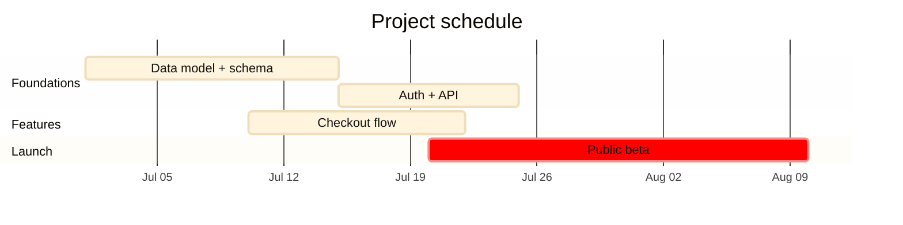

# gantt — schedule / build sequence / roadmap

**Use when** showing work over a timeline: a build sequence, a delivery roadmap, phased milestones with dependencies. NOT for logic flow (use flowchart) or status lifecycle (use state).

## Canonical template

## Task syntax

`Label : [tag,] id, start, duration` — where:
- `start` is a date (`2026-07-01`) or `after <id>` (dependency).
- `duration` is `14d` / `3w`.
- Optional leading tags: `crit` (critical path, red), `active`, `done`, `milestone` (zero-duration diamond).

Example milestone: `Launch :milestone, m1, 2026-08-15, 0d`.

## Gotchas

- `dateFormat` declares the INPUT format; `axisFormat` declares the axis LABEL format. Set both.
- Ids must be unique and reserved-word-free; reference them in `after <id>`.
- Gantt ignores most `themeVariables` colour keys — `textColor` is the main one that helps contrast. If section/bar text is still light on a dark renderer, that's a known gantt limitation; the `textColor` override above covers the title and labels.
- Keep section names short; long task labels overflow the left gutter.
