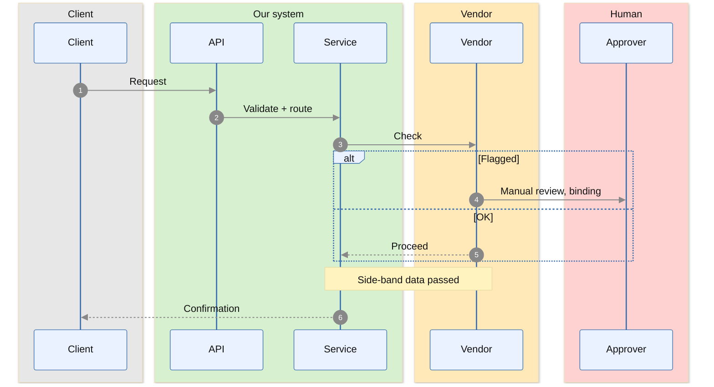

# sequence — message exchange over time

**Use when** order over time matters: an API handshake, a checkout, an approval path, who-calls-whom. Each arrow is a message; the vertical axis is time. NOT for static structure (use flowchart).

## Canonical template — coloured swimlanes + autonumber

## Swimlane colours (match the flowchart palette)

`box rgb(215,240,208) Label` = green (owned) · `rgb(212,228,251)` = blue (reuse/spine) · `rgb(255,233,184)` = amber (vendor) · `rgb(231,231,231)` = grey (external) · `rgb(255,210,210)` = red (human/gate). Participants inside a box must be **contiguous** in declaration order, so order by org/role. Back-arrows across boxes are fine.

## Gotchas (these bite)

- **Reserved-word participant id = silent error bomb.** `participant OFF as …` → mermaid lowercases to `off`, a keyword → "Parse error … got 'off'". Use `SVC`, `OPR`, `END_`. Same for `on`, `as`, `end`, `class`.
- **Do NOT force text dark with `themeCSS 'text{fill:#111}'`** — it overrides `sequenceNumberColor` and the white `autonumber` digits go black-on-dark-badge = invisible. Theme via `themeVariables` (template above keeps `sequenceNumberColor:'#ffffff'`).
- **Do NOT set `.actor` fill in themeCSS** — `.actor` matches the participant *rectangle*, not just its text; you get black boxes with black (invisible) names.
- Message text after the first `:` is freeform — avoid a stray leading `(`; `(binding)` is fine mid-text but prefer `, binding`.
- `alt/else/end`, `opt/end`, `loop/end`, `par/and/end` are the grouping blocks. Indentation is cosmetic; the `end` is required.
- Participant alias text (`as …`) is display text — spaces and `+` fine; avoid `/` and ` ` in participant aliases (keep them short, single-line).
