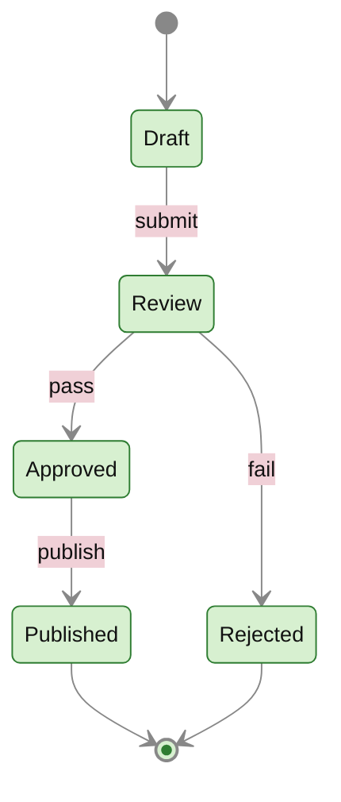
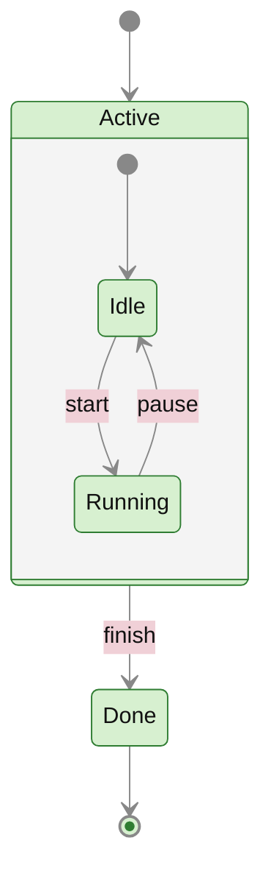

# state — lifecycle / status machine

**Use when** a single thing moves between named statuses over its life: a document (draft → review → published), a support ticket, an order, an agent task. Use `stateDiagram-v2` (newer renderer, better layout).

## Canonical template

## Composite (nested) states

## Gotchas

- `[*]` is the start/end pseudo-state. Transition labels go after `:`.
- State **names** can't contain spaces directly — use an alias: `state "Long name" as S1`, then transition on `S1`.
- For choice/branch points: `state c <<choice>>` then `c --> A: cond1` / `c --> B: cond2`.
- `direction LR` (top of the diagram body) flips orientation if it grows too tall.
- No `classDef`-style colouring is needed for most state diagrams; the contrast header is enough. To colour a state: `classDef done fill:#d7f0d0,color:#111` then `class Published done`.
